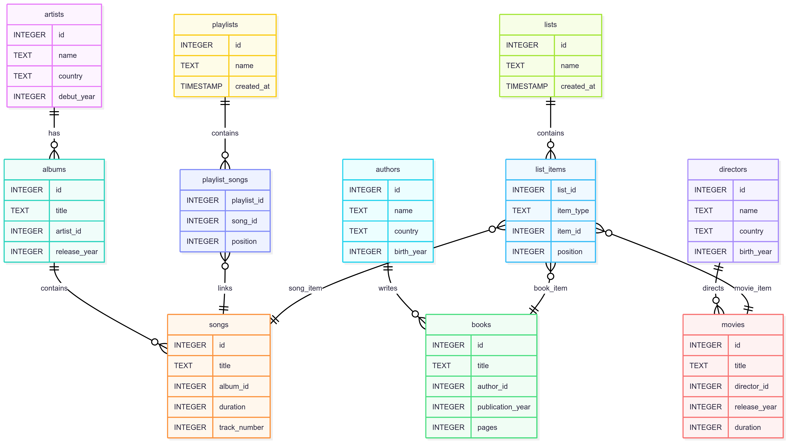

# Design Document

By Eliza Febriana

## Scope

This database is a personalized media library manager inspired by Spotify, Goodreads, and Letterboxd, created for CS50 SQL. It allows users to organize their favorite music, books, and movies, and create custom lists to group them.

Included in scope:

- Favorite artists (with country and debut year)
- Favorite authors (with country and birth year)
- Favorite directors (with country and birth year)
- Albums for each artist
- Songs for each album
- Books with publication year and pages
- Movies with release year and duration
- Custom lists (generalized beyond music playlists) to organize any items
- Items in lists with ordering and type

Out of scope:
- Playback of audio/video
- Cover art, ratings, or reviews
- User accounts or permissions
- Collaborative sharing

---

## Functional Requirements

The database supports:

- Adding, viewing, and managing artists, authors, and directors
- Adding albums for artists, and songs for each album
- Adding books and linking them to authors
- Adding movies and linking them to directors
- Creating general lists and adding any item (song, book, movie) to a list
- Ordering items within lists
- Querying media metadata (e.g., song length, book pages, movie duration)

---

## Representation

All entities are represented as SQLite tables:

### `artists`

- `id`: `INTEGER PRIMARY KEY`
- `name`: `TEXT NOT NULL`
- `country`: `TEXT`
- `debut_year`: `INTEGER`

### `albums`

- `id`: `INTEGER PRIMARY KEY`
- `title`: `TEXT NOT NULL`
- `artist_id`: `INTEGER NOT NULL` (foreign key to `artists.id`)
- `release_year`: `INTEGER`

### `songs`

- `id`: `INTEGER PRIMARY KEY`
- `title`: `TEXT NOT NULL`
- `album_id`: `INTEGER NOT NULL` (foreign key to `albums.id`)
- `duration`: `INTEGER NOT NULL` (in seconds)
- `track_number`: `INTEGER`

### `authors`

- `id`: `INTEGER PRIMARY KEY`
- `name`: `TEXT NOT NULL`
- `country`: `TEXT`
- `birth_year`: `INTEGER`

### `books`

- `id`: `INTEGER PRIMARY KEY`
- `title`: `TEXT NOT NULL`
- `author_id`: `INTEGER NOT NULL` (foreign key to `authors.id`)
- `publication_year`: `INTEGER`
- `pages`: `INTEGER`

### `directors`

- `id`: `INTEGER PRIMARY KEY`
- `name`: `TEXT NOT NULL`
- `country`: `TEXT`
- `birth_year`: `INTEGER`

### `movies`

- `id`: `INTEGER PRIMARY KEY`
- `title`: `TEXT NOT NULL`
- `director_id`: `INTEGER NOT NULL` (foreign key to `directors.id`)
- `release_year`: `INTEGER`
- `duration`: `INTEGER` (in minutes)

### `lists`

- `id`: `INTEGER PRIMARY KEY`
- `name`: `TEXT NOT NULL`
- `created_at`: `TIMESTAMP DEFAULT CURRENT_TIMESTAMP`

### `list_items` (generalized join table)

- `list_id`: `INTEGER NOT NULL` (foreign key to `lists.id`)
- `item_type`: `TEXT NOT NULL` (must be one of: `song`, `book`, `movie`)
- `item_id`: `INTEGER NOT NULL` (references the appropriate id depending on type)
- `position`: `INTEGER`
- `PRIMARY KEY (list_id, item_type, item_id)`

---

## Entity Relationship Diagram

---

## Relationships

- An **artist** can have many albums
- An **album** belongs to one artist and contains many songs
- An **author** can write many books
- A **director** can direct many movies
- A **list** can hold many items of any type (song, book, movie), using `list_items` to track positions and types

---

## Sample Data

Favorite media included:

**Artists**:
- Radiohead
- The Verve
- The Smiths
- LANY
- Fleetwood Mac

**Authors**:
- Mitch Albom
- Paulo Coelho
- Fyodor Dostoevsky
- Emily Henry, and others

**Directors**:
- Quentin Tarantino
- Martin Scorsese
- Stanley Kubrick
- David Fincher, and others

**Sample lists**:
- *Late Night Chill* (music playlist)
- *Summer Reads* (book list)
- *Top Movies* (movie list)

---

## Optimizations

- Composite primary keys on `playlist_songs` and `list_items` to avoid duplicate entries
- Foreign key constraints maintain referential integrity
- Durations stored in integers for easier calculations
- Highly normalized design for scalability

---

## Limitations

- Single user only
- No ratings, genres, or reviews yet
- No search indexes beyond default primary keys
- No support for collaborative lists

---

